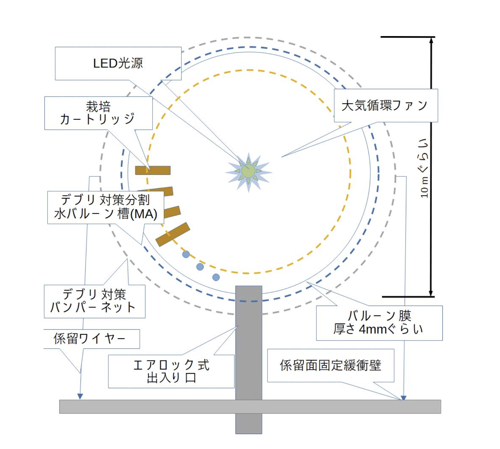
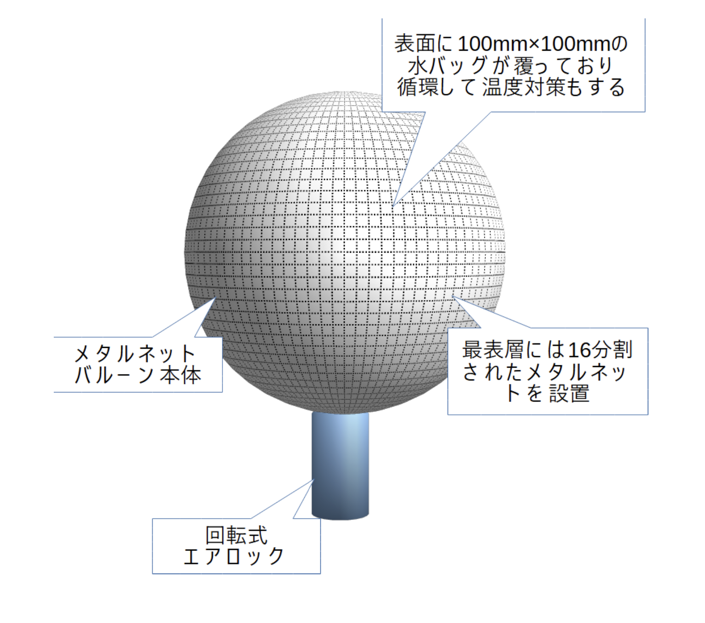

# 要旨
宇宙農場における重力について考察し、バルーン形状の水耕栽培プラントに対する人工重力の影響を主に材料力学の観点から計算する。

# はじめに
生物は常に重力を受ける環境で進化してきた。
人間も例外でなく、宇宙空間のような微小重力環境では様々な弊害が起こることが知られている。
現状での主な対応方法は運動をすることであるが、宇宙飛行士の貴重な活動時間が犠牲になっている。

また、アルテミス計画の一部である月面基地建設、そこからの火星探査を実現するためには、地球からの輸送に頼らない宇宙での自給自足体制の確立が必要不可欠である。
採算を考慮した現実的な方法として、野菜を中心とした植物の宇宙農場の建設が考えられる。
先行研究として、バルーン形状の水耕栽培プラント「メタルネットバルーンプラント」(以下、MNBP) \[busyoucow/spacefarm\] があり、この装置をベースにして本記事を展開していく。

今回は、植物栽培に致命的な影響を与えない重力の大きさを考察し、MNBP の強度を計算する。

# 植物栽培における重力の大きさ
> Manzano ら(2018)は，従来の 3D クリノスタットを改造し，地上においても低重力環境を模擬した環境を作り出す装置(低重力可変型 3D クリノスタット)を開発し，模擬低重力環境応答の解析を報告している。
この装置は，3D クリノスタットの試料台を，これまでの直交 2 軸による 3 次元回転に加え，回転(遠心)させることで，試料に遠心力を加えて µg よりも高い重力環境を与えることができる。
彼らは，この装置を利用して，地上 1 g, 疑似微小重力(µg)，および，月や火星表面の重力を模擬した 0.17g と 0.38g を作り出し，シロイヌナズナの根の成長に及ぼす影響を解析した。
その結果，根の細胞は 1g 環境と比較して，0.17g では，µg と同様に細胞の増殖速度は速くなるものの，細胞の大きさが小さくなることを報告している。なお，0.38g 環境では，根の細胞の増殖速度，大きさは 1g 環境と比較して有意な差異は認められなかった。
このような植物生育の低重力応答，さらには低重力に依存した応答に関する知見はまだ少なく，今後精力的に実施し，知見を増やす必要があるであろう。

Manzano ら(2018)は，低重力可変型 3D クリノスタットを開発し，模擬低重力環境応答の解析を報告している。
彼らは，この装置を利用して，地上 1 g, 疑似微小重力(µg)，および，月や火星表面の重力を模擬した 0.17g と 0.38g を作り出し，シロイヌナズナの根の成長に及ぼす影響を解析した。
その結果，根の細胞は 1g 環境と比較して，0.17g では，µg と同様に細胞の増殖速度は速くなるものの，細胞の大きさが小さくなることを報告している。なお，0.38g 環境では，根の細胞の増殖速度，大きさは 1g 環境と比較して有意な差異は認められなかった。


** 図1 **

上記より、0.38g では植物の成長に致命的な影響はないと仮定する。

# MNBP について




\[1\] にて、すでに MNBP の諸元の方針が決められているので引用する。

**表１ MNBP諸元（和紙＋こんにゃくを素材に用いた場合）**
|バルーン直径m|バルーン表面積m3|バルーン厚さm|比重|バルーン重量t|材質          |破断強度MPa|気圧|圧力(Pa)|応力(MPa)|
|:----      |:----         |:----      |:----|:----    |:----        |:----     |:----|:---- |:----   |
|10         |314           |0.0018     |1.3|0.7        |和紙＋こんにゃく|525       |0.1|10133  |417      |

# 人工重力を発生させる回転が MNBP に与える影響について

人工重力発生のために、


```
a = vω = rω^2
となり，働く力，遠心力，は，
F = ma = mrω^2
```


- バルーンを回転
  - 回転のGに耐えられるか？
    - 和紙こんにゃくはアルミニウム程度の破断強度？
      - 金属の種類	材料記号・熱処理	引張強さ（T/MPa）
      - 純アルミニウム	A1085 P（焼鈍し）	55
      - https://aroroi.com/2022/02/12/%E9%87%91%E5%B1%9E%E6%9D%90%E6%96%99%E3%81%AE%E5%BC%95%E5%BC%B5%E5%BC%B7%E3%81%95%E3%81%AB%E3%81%A4%E3%81%84%E3%81%A6/#%E3%81%84%E3%82%8D%E3%82%93%E3%81%AA%E6%9D%90%E6%96%99%E3%81%AE%E5%BC%95%E5%BC%B5%E5%BC%B7%E3%81%95%E3%81%8C%E3%82%8F%E3%81%8B%E3%82%8B
    - 厚さ 1.8 mm
    - ペラペラだが、宇宙なので空気抵抗はなく、回転してもOK?
      - 半径:=L=5m, 質量:=m, 角速度:=ω\[rad/s\]
      - P = mLω^2
      - σ = P/A = WLω^2/A
      - https://kazubara.net/mechanical-design/materials-mechanics/syoshinnsyademowakaruzairyourikigaku25-bodyforce25/#index_id2
      - モジュール 100本だと仮定、
      - フレームをナイロンにすると？円周上に配置
      - ミスト栽培にすると半分か2/3になりそう？
       - 水耕は4.6kg/モジュール
    - 内圧？
    - 成長点 組織培養
    - 植物の成長に限らなくても、水の循環のため、みたいな話の進め方もあり
- 余計な熱で回転？
- 水耕栽培
  - 円柱？だるまおとし
  - 速度差をつけたらどうなるか？
    - 水の循環？
- 気流も生まれる？

# 考察

# まとめ

# 参考文献
- [BSJ-Review11A_83-89](https://bsj.or.jp/jpn/general/bsj-review/BSJ-Review11A_83-89.pdf)
- Manzano, A., Herranz, R., den Toom, L.A., te Slaa, S., Borst, G., Visser, M., Javier Medina, F. & von Loon, J.J.W.A. 2018. Novel, Moon and Mars, partial gravity simulation paradigms and their effects on the balance between cell growth and cell proliferation during early plant development. npj Microgravity 9: 1-11.


# 以下、メモ
-----

- [宇宙で“自給自足”!? 「植物工場」は宇宙での食料調達の救世主となるか | EMIRA](https://emira-t.jp/special/23071/)
  - 
  - 主食、穀物
  - 小さいコンパクトな品種
  - > そして、無人化、機械化による効率化です。国際宇宙ステーション内での栽培実験などにより、無重力下でも根は水を吸うことができ、根は下へ、葉は光の方向へ伸びることが分かっているので、既に確立されている栽培技術が宇宙にも応用できるだろうという見込みはついています。問題は、地球の1/6の重力である月面で実がどのようになり、それをどのように収穫するのかというところ。地球の農業でも自動化は研究が進んでいますが、そういった技術を取り入れ、人間を介さずに収穫までできるようにしていくことが必要です。
  - 廃棄物を微生物でリサイクル

```
# プラント設計と収支

栽培ユニットを設置する栽培プラントバルーン内を１気圧とした。

しかし栽培プラントバルーンの強度が不足するため、まずバルーン内圧力を再検討する。

|バルーン直径m|バルーン表面積m3|バルーン厚さm|比重|バルーン重量t|材質|破断強度MPa|気圧|圧力(Pa)|応力(MPa)|
|:----|:----|:----|:----|:----|:----|:----|:----|:----|:----|
|10|314|0.002|1.1|0.7|スチレンブタジエンゴム|25|1|101330|1250|
|10|314|0.0018|7.85|4.4|鋼鉄S45C|7038|1|101330|500|
|10|314|0.0018|1.3|0.7|ポリカーボネート|60|0.1|10133|417|
|10|314|0.0018|1.3|0.7|ポリウレタン|100|0.1|10133|417|
|10|314|0.0018|1.3|0.7|ポリプロピレン|40|0.1|10133|417|
|10|314|0.0018|1.3|0.7|和紙＋こんにゃく|525|0.1|10133|417|


プラントのバルーン部は内圧を当初１気圧で考えていたが、素材の問題により0.1気圧とする。

和紙＋こんにゃくというのはWW2の太平洋戦争にて旧日本帝国軍が開発した風船爆弾の風船部分である。

このように栽培プラントバルーンは0.1気圧にて高強度の非金属を使用する事を前提として次案を考える。
```

- 参考？
  - [DigitalBlast、宇宙での植物栽培に向け北海道大学 藤田知道研究室との共同研究開始　擬似的な弱重力環境で植物を栽培、ゲノムレベルでの変化を探る – 北海道大学 大学院理学研究院](https://www2.sci.hokudai.ac.jp/faculty/research-news/10149)

# 人体
- 気圧変化による気象病？は改善するか？
- 地球での畜産による環境負荷を実感するために、あえて宇宙で畜産してみる？
- 妊婦は重力発生装置にこもる可能性がある。ストレス対策として食のバリエーションが必要かも
- 起立性調節障害
  - HDBR法
  - 診断が難しい
    - 怠けている、生理では？と思われがち
    - 2週間データを取る必要があるが、...
    - 可視化できれば、対応方法がたくさんあるので、改善につながるだろう
- スーツで改善？
  - EMS
  - 着圧？
  - マッサージ？
  - 超音波？骨量
- 宇宙飛行士のバイタルチェック
  - どうなっているのか？


# JAXA 月面農場ワーキンググループ検討報告書 第１版
- 3Dクリノスタット
  - https://youtu.be/WOxT5J_KyPI?si=bK_QYAqqMGw7UhvK
  - なぜ回転で無重力を再現できるのか？
- 生殖異常は温度上昇のみが原因なのか？
  - 重力発生装置の中であれば防ぐことができる？
- 有害ガス
  - エチレンなど
- 無重力での給水
- 水耕方式
  - NFT?
  - DFT?

# 調査
- 先行研究
- 論文

## 組織・機関
- NASA
- JAXA
- ロシア？

# 悪影響
## 野菜
- ???

## 人体
- 骨量
- 筋力
- むくみ・血流

### 短期的
- 体液循環
  - 味覚・嗅覚
  - 尿量増加・体液減少
- 背が伸びる
- 赤血球減少why?

### 中期？
- 骨量減少
  - 腎臓結石
  - 骨粗鬆症、10ヶ月、30->75歳
- 筋力減少
- 心筋、無重量、低体液量
- 窒息
  - 二酸化炭素、滞留
- 感染
  - 飛沫感染、無重量
  - 初期は問題
  - アポロ計画、殺菌
  - 現在、フィルター
- 3,4時間運動perDay
- 受精率低下

# 改善方法
- スペースコロニー
  - 重力発生装置


- 野菜
  - 豆
  - 葉物
  - 穀物
  - そもそも無重量状態が悪影響を及ぼすのか？


- 動物
  - 畜産
    - 短期間であれば問題ない？
    - 摂取時の人体への影響は？
  - 人間
    - 人工授精で受精率低下を改善？


# その他
- 無重量状態
  - 創薬
  - 物質合成
  - 炎が球形
  - 蜂蜜、蓋と瓶が繋がる
  - 宇宙に行った初のカメは1968年9月14日にソ連によって打ち上げられた。ゾンド5号に乗せれたヨツユビリクガメはチーズバエ、ミールワーム、その他の生物標本と共に月を周回した。これらは深宇宙に行った初の生物となった。カプセルは無事9月21日に海上で回収された。地球帰還後の動植物はモスクワに生きたまま戻された[8]。

# リクエスト・ディスカッション
- @busyoucow
  - 煮豆は大変だ、という結論になりそう
- @reodon
  - 野菜に対する影響を人体の後にして、悪影響だけでなく良い影響もある、ボリュームを増やす
- @nanbuwks
  - 静止軌道までもっていくと大変なので、低(中)軌道で展開
  - 低軌道はデブリ多すぎるからもう少し高いところかも
- misc.
  - 今後10年間で利用可能な科学技術を想定
  - 100-1,000人規模
    - 100人超えたあたりで食料自給が必要になりそう
    - 100人規模ではダメで、1,000人規模でないと採算取れない
  - 火星開発は現時点では構想のみ
  - アルテミス計画
    - アルテミス7号2032年
      - 月面に小規模基地を建設
